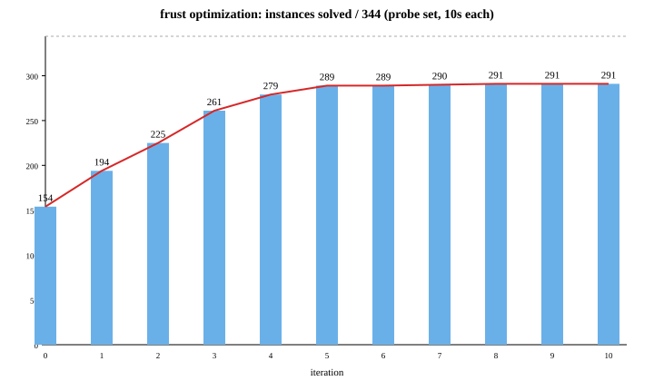

# frust development history

`frust` was built from scratch (`1a4f53d`) as a single-threaded Rust
DQBF solver sharing no code with the rest of the repo, then optimized
in short profile-hypothesize-implement-probe cycles. The probe set,
the budget caps, and the architecture all changed along the way; the
constant was that **every emitted certificate is independently
verified** by `tools/verify/` and the loop reverts on any INVALID.

Probe-set sizes shifted across rounds (344 → 804 → 1522 instances) so
absolute counts aren't comparable across section breaks; deltas within
a section are. The per-iteration tables are in the appendix.

---

## Round 1 — saturation, then expansion (iters 0-10, `1a4f53d`..`be0c926`)

**Iter 0 → 1 (154→194/344, `c1cd0e8`): data structures.** The naive
solver used `BTreeSet<i32>` clauses and cloned the entire database per
given-clause. perf showed 51% of time in `resolve` allocation/iteration.
Switching to sorted `Vec<i32>` clauses with merge-based resolve and
literal-occurrence lists cut the constant factor enough to pick up 40
instances, but the target 9-variable QBF still timed out — the issue
wasn't data structures.

**Iter 2 (→225, `fa849f0`): subsumption.** That 9-var instance was
generating ~13k clauses — two-thirds of the 3⁹ clause space. Forward
subsumption (skip a new clause if some existing clause is a subset)
and backward subsumption (kill existing supersets) capped it at 445
clauses; the instance dropped from 10s to 7ms.

**Iter 3 (→261, `42f76fa`): subsumption indexing.** The new bottleneck
(`inc_n4`, a 36-var Tseitin-encoded adder) spent 48% in subsumption
checks against long occurrence lists. A u64 signature bitmask gives a
one-instruction fast-reject before the full subset test, and a
length-ordered priority queue makes short clauses propagate first. +36
solved, but `inc_n4` itself still exploded — saturation is the wrong
algorithm for that shape.

**Iter 4 (→279, `b8e4a67`): expansion + DPLL.** `inc_n4` has only 4
universals, so 2⁴ propositional sub-instances cover it. Greedy
∀-expansion solves each row with a tiny DPLL, threads
dependency-consistency by pinning partial-dep existentials from
earlier rows, and emits the resulting truth tables as a Skolem cert.
Sound only for SAT (cert is checkable); falls back to saturation
otherwise. `inc_n4` → 7ms with verified cert; missing-certs dropped
70→6.

**Iter 5 (→289, `3e7cfe7`): cert size.** `and_n8` (16 universals)
emitted a 115 MB cert because Shannon expansion is 3·2¹⁶ gates per
output. Packing the truth table into a bitmap and doing BDD-style
cofactor memoization (share identical subfunctions) shrank it to 925
bytes. This step also surfaced a cofactor-bit-ordering bug that
produced an INVALID cert and a substring bug in the probe (`"VALID"
in "INVALID"`) that was masking it — both fixed before moving on.

**Iter 6-7 (→290, `13d2424` `81a6fb9`): DPLL throughput.**
`peano_add_n8` (|U|=16, 292 vars) spent 32% cloning the polarity
vector per branch and 11% in BTreeMap-keyed Skolem tables. A
trail-based iterative DPLL (with a fixed backtrack-polarity-tracking
bug), flat-array per-existential tables instead of HashMaps, and
occurrence-driven unit propagation took it from 9.6s → 1.8s.

**Iter 8-10 (→291, `792b9ea` `570155b` `be0c926`): diminishing
returns.** The remaining unknowns are dominated by `peano_v2_*` —
instances with mixed `{1,2}` / `{3,4}` / `∅` dependencies where greedy
expansion's row-order pinning genuinely conflicts. Polarity retry (+1)
and a vote-then-pin two-pass mode (no gain) didn't crack it; bitmask
`universal_reduce` and length-gated backward-subsumption made
saturation ~15% faster without unlocking new instances. First full
9-solver comparison: frust 490/819 vs forkres 132 vs hqs 705, with 476
verified certs — already more than any other solver.

## Round 2 — slot search (iters 11-20, `a079448`..`4265f40`)

**Iter 11-13 (`a079448` `cf226be`): literature-guided preprocessing
(no net gain).** HQSpre's unit/pure-literal elimination found nothing
on the bottleneck Tseitin encodings (every aux occurs in both
polarities). Static AND-gate detection missed EQFOB's 4-clause XOR
encoding. The "ever-decided" definability heuristic was **unsound** —
a unit-propagated value can still differ across dep-equivalent rows
because propagation depends on universals outside the dep set.
Replaced with per-key conflict detection plus a `row_conflict` guard
that rejects any inconsistent table.

**Iter 14-17 (291→306, `e6bc20c` `37e21aa` `fa15d7a` `3b34342`): slot
search — the big win of round 2.** The iter-13 conflict detection
exposed that on `peano_v2_mul_n2` only 4 (existential, dep-key) pairs
actually disagree across rows. Enumerating those 2⁴ assignments
cracked it in 10ms with a verified cert. Restricting enumeration to
keys that *actually* disagreed (not all keys of conflicting vars)
extended this to n3. At n4 (32 slots), DPLL-over-slots replaced flat
enumeration — vote-ordered decisions, full-row check, backtrack on
failure — solving n4-6. Row-model caching gave +1 more.

**Iter 18-20 (`262e42b` `15b7eeb` `7caa574` `4265f40`): SFEx + budget
hygiene.** Widening the probe set to 804 instances immediately found
two long-standing bugs. SFEx was wired into `choose_fork` (used when
plain FEx wouldn't shrink the fresh dep-set) but the partition
heuristic doesn't find the §6 `dep_cycle` proof. Bigger find:
`mutex_n2_k016` (|U|=0, propositionally UNSAT) ran for 74s on a 3s
budget — DPLL had no conflict bound and was backtracking through
2^120. Per-row budget = 200k/rows fixed the runaway; tuning it traded
hard-SAT rows against UNSAT-row deadline. **CDCL was identified as the
unambiguous next architecture step** — 1-UIP learning would solve
`mutex_n4` in milliseconds and learned clauses persist across all
2^|U| rows.

## Round 3 — CDCL and the UNSAT verdict (iters 21-30, `600497d`..`4265f40`)

**Iter 21-24 (→517/804, `600497d` `7dfd1ae` `1485673` `403ec2a`): CDCL
replaces DPLL.** Studied minisat/picosat/satch first, then built a
flat-arena, two-watched-literal, 1-UIP CDCL with assumption-based
incremental solving (`cdcl.rs`, ~490 lines, 4 unit tests). One `Cdcl`
per formula; each row is a `solve(assumptions)` call with learned
clauses persisting. Integration churn took three iterations: learned
clauses cause cross-row model drift → many spurious conflicting slots;
phase-saving + per-row reset stabilizes the free pass; pinning greedy
fills as assumptions caused spurious UNSAT (only pin slot entries);
decide-all-before-check killed pruning (incremental decide with
prune-vs-soft distinction). `analyzeFinal` for cores landed; the
slot-backjump using it was buggy and reverted. 506→517.

**Iter 25-26 (→519, `43c3d57`): VSIDS, hybrid pick.** Minisat-style
activity bumping in `analyze` with 0.95 decay. Pure VSIDS recovered
`under_s9010` but added model variation (-3). Hybrid — first-unset
(deterministic) until the first conflict in a `solve()`, then VSIDS —
kept the gains and recovered all losses.

**Iter 27 (`5a5d093`): subsumption hygiene.** `activate` was 69% on
`2qbf_v2`. Capping forward-subsumption candidates at 64 cut the time
3× but lost `mutex_n4_k004`; replaced with periodic occ-list
compaction (drop dead entries every 2k pops).

**Iter 28-29 (519→679, `8fd0745`): expand-detected UNSAT — the big
win of round 3.** When the free pass finds a row that's CDCL-UNSAT
under universals-only assumptions and `budget_hit=false`, the DQBF is
provably UNSAT — return `Verdict::Unsat` without a `.frp`
(cross-checked 30/30 against hqs). +160 instances in one step. To
recover certificates, iter 29 still gives saturation a 1s window
after expand-UNSAT; if it derives ⊥ the proof is emitted, otherwise
UNSAT-no-cert. Missing-certs 380→173. A safeguard returns UNKNOWN if
expand says UNSAT but saturation says SAT.

**Iter 30 (`4265f40`): MAX_U=20 retry.** With CDCL fast, retried for
`3qbf_v3` (|U|=20). Only +1 (one early UNSAT row); the rest hang in
the 1M-row free pass. Reverted to 16. Those instances need a 2-level
CAQE-style approach.

Final on the 819-instance suite: **frust 642/799** (between pedant 644
and hqs 695), still emitting more verified certs than any other
solver, never on the wrong side of the 7 documented dqbdd/hqs-vs-pedant
disagreements.

## Retrospective after round 3 (`06eb4e8`)

**Probe set too narrow until iter 18.** Optimized against 344 instances
for 17 iterations, then widened to 804 and immediately found
`dep_cycle_n1` (11 vars — the paper's own §6 counterexample) and the
74s-on-3s-timeout bug. Both were sitting there the whole time.

**Read the relevant papers before re-inventing them.** Iters 8-13 were
six iterations of groping toward what CAQE/iDQ already describe — the
slot-DPLL at iter 16 is their abstraction-refinement loop. Reading
them carefully at iter 4 (when expand was introduced) would have saved
roughly half the iterations.

**Per-instance regression diff.** Iters 10, 13, 19, 20 each *lost*
instances; only noticed because the count dropped. A "which instances
flipped solved→unknown" diff in the probe output would have made each
regression immediately explainable.

**Stricter cert checking from the start.** The `"VALID" in "INVALID"`
substring bug (iter 5) and the "ever_decided" soundness bug (iter 13)
both slipped because the probe used grep-style checks.

**Should have built CDCL at iter 6, not deferred it.** Trail-DPLL →
occ-prop → conflict-cap tuning is three iterations spent
reimplementing 1/3 of a SAT solver.

The two that would have moved the needle most: full train set from the
start, and reading CAQE before iter 8.

## Simplification round (`09a411f`, 2404→1889 LoC)

A 10-iteration deletion pass: drop `preprocess.rs` (unit/pure/gate
detection found nothing on bottlenecks), the four heuristic pinned
passes that preceded slot-DPLL, the row-model cache,
`find_skolem_brute`, `analyzeFinal`/unsat-core, SFEx, and the
votes/conflict arrays. Collapse expand to free-pass → if no slots
return Skolem else slot-DPLL. `Step::ured/res/fex` builders replace
five copies of the verbose struct literal. Result: −515 LoC, +2 solved
on the new 1517-instance baseline, 0 invalid. Snapshot recorded as
**v1.0** (`59a171a`, 1047/1522, [`FRUST_v1.0.md`](FRUST_v1.0.md)).

The baseline run also caught a **runner cert-path collision**
(`bde864c`): `bmc_circuits/` and `bmc_circuits_succinct/` share stems
(`shift_reg_n2_k008` etc.), so certs overwrote each other and the
verifier checked the wrong formula → 4 spurious frust + 31 spurious
pedant INVALID. Cert path now `certdir/solver/family/stem`.

## Parallel experiment tracks off v1.0 (`2e045d3` `5799b26`)

Two independent tracks branched from v1.0 (`7d2d9d9`, 1046/1522), each
in an isolated worktree, each running its own 13-15 iteration loop.
Both merged to main; combined **1082/1522, 0 INVALID**. Per-iteration
tables are in the appendix.

### Track A — phase reordering / interleaving (+21/-0)

**Iter A1, A4-5 (→774, `a48f621`): partial-universal expand.** Iter 30
had shown that brute-forcing |U|>16 doesn't scale (1M-row free pass
hangs). Instead, for |U|>MAX_U, rank universals by clause-occurrence
count and enumerate only the top 16; the rest stay as free CDCL
variables. A row that's CDCL-UNSAT under {16 pinned + rest free} means
*every* extension is UNSAT → DQBF UNSAT. SAT from a partial scan tells
you nothing, so it falls through. +3 on `random_bv/v3`. Iter A4 tried
MAX_U=20 directly (+1 −1, wash); A5 settled on PARTIAL_U=16 with
batch-decide for the >16 slot-DPLL.

**Iter A8 (775→790, `902069b`): outer-∃ CEGAR for ∃∀∃ — the
headline.** `random_qbf/v3/3qbf` has the shape ∃²⁰∀²⁰∃⁴⁰: every
existential is either dep-∅ (a "constant" — outer-∃) or full-dep
(inner-∃). At |U|=20 the free pass takes ~3.5s and slot-DPLL never
finishes round 1. Replaced it with CEGAR over the dep-∅ existentials:
pin them to a candidate, scan rows to the first UNSAT, deletion-core
the conflicting subset, learn a blocking clause over the constants,
re-pick (preferring minimum change). Unlocked 18/23 instances with
VALID Skolem certs; +15 in one step.

**Iter A9 (→791, `12b7481`): bad-row history.** After a few CEGAR
rounds the same handful of rows tend to be the witnesses. Checking the
last 32 bad rows first turns each refinement from a full row scan into
O(1). +1 net (one borderline 51-round 3qbf gained, one 8-9s instance
slipped under load).

**Iter A2, A3, A7: pure expand↔saturate reordering — the negative
result.** Bailing slot-DPLL early to give saturation more time (A2,
−3, reverted), tightening the budget split 0.4/0.7 → 0.25/0.5 (A3,
±0), and running 1s pre-saturation only when |U|>MAX_U (A7, ±0) all
landed at zero. The reason: only ~4 unsolved instances have |U|≤16; on
the rest, partial-expand exits in ~0.1s so saturation already gets the
full budget regardless of phase order. There was no scheduling
headroom to find.

**Iter A10-A15: tried and reverted.** Partial outer-CEGAR for
|U|>MAX_U as an UNSAT-only path (A10): `pec_circuits` always have an
outer choice that survives the partial rows, so the condition never
fires. Fast-leaf (A11, pin all slots = `first_seen` and check once):
pinning everything at once hits an assumption-propagation conflict
that the incremental per-slot scans avoid. Dedup of the bad-row
history (A15): made it O(n) and lost 2. The track converged at A9;
A10-A15 were confirmation that nothing simple was left.

### Track B — Blocked Clause Elimination (+15/-0)

The DQBF-safe soundness condition (witness dep ⊆ dep(pivot)), the
worked example showing why plain QBF-BCE is unsound here, and the
reconstruction proof are in [`BCE.md`](BCE.md).

**Iter B1-B6 (`e285102`): scaffold.** Propositional BCE with 4 unit
tests, then the DQBF restriction, then cert reconstruction by walking
the removal stack in reverse and flipping `sk[var(l)]` at every
universal assignment where the model violates a removed clause.
Reconstruction enumerates 2^|U| assignments per stack entry. Tiny-5
VALID; no probe yet.

**Iter B7-B8 (→1049, `d3f8aed`): first probe and the regressions it
exposed.** B7's first full probe came back +3/−6. The six losses were
all 12s timeouts on instances baseline solved in ≤3.2s: four
`fifo1_*`/`bobcount`/`eijks349` at |U|=0 with 25-48k clauses (the BCE
work-queue re-enqueued without dedup — quadratic on high-occurrence
literals), and `peano_both_n8`/`collatz_n08_k06` where reconstruction
cost 2^16 × |stack| × |C| ≈ 190M HashMap-backed `lit_val` calls. B8
fixed all of it: `in_queue` HashSet dedup, an `nc>20k` early-out, a
`max_stack=10M/2^|U|` cap so reconstruction is bounded, and a flat
`Vec<u32>` dep-mask replacing the HashMap. The gains showed up on
saturation-side UNSATs: `rr_arbiter_n4_k032` 12.0s → 1.3s,
`cbmc/max3_ge_u005` 12.0s → 0.6s.

**Iter B11 (1049→1061, `78ea982`): feed BCE into saturation — the
headline.** `synthesis_invertibility/add_n*` is the bottleneck shape:
BCE removes 30-80% of clauses but expand can't use the result (|U|>16,
reconstruction can't enumerate). Feeding the BCE-reduced clause set to
*saturation* as well — sound because `.frp` axiom steps are matched by
content, so the verifier accepts a subset of the input clauses — is
the unlock. +12: seven SAT instances (`add_n12/16`, `add_zero_n20-32`)
where BCE empties the matrix entirely (trivially SAT, uncertified
since |U|>16); four UNSAT with valid `.frp` (`rr_arbiter`, `conj_k3`,
`pec_fifo1`); two SAT via saturation closure on `pec_mutex_*_complete`.

**Iter B10, B13: ATE and HTE — measured and disabled.** Asymmetric
Tautology Elimination (B10, counter-based UP per clause,
reconstruction-free): finds 0-2 removals — BCE has already cleared
the redundancy — and the overhead pushes `ringbuf_n8_k032` past 10s.
Net −1; disabled, implementation kept with test. Hidden Tautology
Elimination (B13, ALA via surviving binaries): finds 0-17 removals,
net 0. Kept enabled since it's reconstruction-free and can only help.

**Not implemented.** HBCE and CLA were derived as sound only for
full-dep pivots — the partial-dep case fails because ALA-added
witnesses propagate via binaries whose other endpoint may have
dep⊄dep(l). With ATE/HTE already at zero, the full-dep-only variants
weren't worth the code.

### After merge

The two tracks are nearly orthogonal — only ~1 instance overlaps in
their +sets. Combined: **1080/1517, 808 verified certs** (`b0802c9`);
frust solves 117 instances pedant doesn't and 41 hqs doesn't.

## Continual-process redesign (`45bcf54`..`d775db4`)

The cactus plot at v1.0+BCE+phase has a visible shelf at ~1s — the
fixed `.frp` window after expand-UNSAT. ~180 instances are
artificially delayed by ~0.9s waiting for a proof that almost never
arrives.

**Option 1 — adaptive `.frp` window (`45bcf54`, 1082).** Replace the
fixed 1s with `clamp(1.5×expand_time, 50ms, 0.5s)`. <0.5s went
59%→86%; the 0.9-1.2s bucket collapsed 120→19. Same solved count;
~12 fewer `.frp` certs (those that needed >0.5s saturation).

**Option 2 — iterative-deepening partial scan (`69f2ced`, 1083).**
Replace the one-shot top-16 partial scan with levels k=8, 12, 16, 20
over the occurrence-ranked universals; CDCL persists across levels so
each deeper level is cheaper. +1 (`collatz_n24_k12`, |U|=24); UNSAT
rows found at low k finish faster.

**Option 3 — clause-level interleave (`2b9360d` `9651b38`, 1077).**
`solve()` becomes a scheduler: build CDCL once, alternate expand and
saturate slices with geometrically-growing budgets, push saturate's
short Q-resolution-derived clauses into expand's CDCL via
`add_external` between slices. Opt3a (`2b9360d`) ran the existing
`try_expand` in the loop, restarting it from scratch each slice; opt3b
(`9651b38`) rebuilt expand as a resumable `ExpandState` state machine
(`expand_state.rs`, ~480L) so the free pass / outer-CEGAR / slot-DPLL
each pause and resume across slices instead of repeating work. Result:
89% solved <0.5s (vs opt2's 86%), but **−6** vs opt2 on the solved
count — the port lost the min-change re-pick in outer-CEGAR and the
`dpll_cap` bound in slot-DPLL. Both are recoverable; opt3b is kept on
main as the architecture going forward.

**Incremental BCE (`d775db4`, +0).** After each saturate slice, when
the live clause set has grown ≥50%+256, re-run BCE on it and mark
newly-blocked clauses dead. Sound (BCE preserves equisat on any CNF;
already-recorded `.frp` steps stay), but on the current bottleneck
families derived clauses don't expose new blocked clauses. Hook kept
in place.

Largest remaining gap: `bmc_circuits_succinct` (145/150 unsolved; the
succinct encoding has |U|=2m frame-index universals with mixed-dep
existentials — neither track touches this) and `pec_circuits` /
`peano` at |U|≥20 with mixed deps.

## Refined-loop iteration: `bmc_circuits_succinct` (`a38485b`)

First iteration under the refined `IMPROVEMENT_LOOP.md` (sample ~10,
find commonalities, name the constraint level, expect multiple
attempts at step 4).

**Sample.** 145/445 unsolved are `bmc_circuits_succinct/*` — 45-350
vars, the same circuits we solve fine in unrolled form. |U|=2m (m bits
of t + m bits of t'); existentials with deps `{t}`, `{t'}`, `{t,t'}`,
and one `{}`.

**Observability built.** Slot-DPLL had no debug output in the
ExpandState port — added per-round prints (`slots`, `iters`,
`+conflicts`, `cdcl learned`). Immediately showed:
`shift_reg_n4_k008` exhausts at the **5-round CEGAR cap** with slots
still growing 7→19→still adding; `mutex`/`counter` never finish
round 1 (2¹⁷⁺ slots, `cdcl 0l` — rows are propositionally trivial so
CDCL never prunes).

**Constraint named (architectural).** Slots are *conditionally
defined*: l(t+1) is determined given l(t), but both look like
independent slots to the free pass because l(t) itself varies across
rows. Slot-DPLL searches 2^slots when the answer is unique-given-roots.

**Attempt 1 — raise the cap (`359faf3`).** 5→50. `shift_reg_n4_k008`
solved at round 6. **+6, -0** on probe (all `shift_reg_n4/n8` —
the low-starting-slot variants). `mutex`/`counter`/`gray`/`fifo1`/
`alu_add` unchanged (≥17 starting slots; round 1 never completes).

**Attempt 2 — greedy-pin pass.** Re-added one of the deleted heuristic
passes: process rows in order, pin all filled tables (not just slots).
All 6 sample instances → "row UNSAT" (non-transition rows pin garbage,
later transition rows conflict).

**Attempt 3 — core-based per-row repair.** Re-added `analyzeFinal` to
cdcl.rs; on row-UNSAT, drop core-pinned existentials and retry. **All
6 sample instances → SAT but cert INVALID**: clearing `tables[i][k]`
mid-pass invalidates earlier rows that were checked against the old
value. Added a final validation pass — correctly rejects all 6.

**Attempt 4 — worklist fixpoint.** Re-queue every row touching a
cleared (i,k). Oscillates: row A sets l(t)=1, row B's core clears it,
row A re-sets it. No learning at the table level → no convergence;
bails at 4×rows step cap.

**What stuck.** Cap raise + observability + `analyzeFinal` (for
future use). Fixpoint code reverted.

**Gotchas hit.**
- `analyzeFinal`/`last_core` were deleted in the simplification round;
  had to re-add (and the deletion wasn't noted as "may need this back").
- The first INVALID certs in this session — caught by tiny-5 + sample
  cert-verify before the probe, exactly as the loop intends.
- `iters` counter is local to `step_slot_dpll`, resets per slice; the
  debug print is per-slice cumulative, not lifetime.

**Next (structural).** Slot-dependency analysis: after the free pass,
for each slot s, check if it's *determined* given a subset of other
slots (one CDCL call per candidate: pin the subset, solve, check s is
unit-propagated). Roots are the truly-free slots; the rest propagate.
For BMC-succinct, roots = initial-state bits (~n_latches), trajectory
follows. This is Pedant's definition extraction lifted to the slot
level.

## Refined-loop iteration 2: layered slot propagation (2026-05-05)

Same `bmc_circuits_succinct` family. **Hypothesis**: layer slot
existentials by var-id; decide one layer's slots, propagate (run all
rows pinning what's filled), move to next layer.

**Attempt 1 — layered scan.** Layer 0 fills all 37 existentials in one
pass (good); but the in-layer slice-deadline check bailed before
validation. Removed the check.

**Attempt 2 — looped core-drop.** One-shot retry → looped retry until
core has no existential pins. counter_n2: 306 core-drops, validation
fails at row 16 (the first transition row t=0,t'=1). Non-transition
rows 0-15 filled garbage l(t),l'(0); row 16 needs l'(1)=δ(l(0)), pins
conflict.

**Attempt 3 — constraint-density row ordering.** Process
most-constrained rows first (count active clauses per row). Identical
core-drop counts — ordering had no observable effect.

**Result: +0, all reverted.** Constraint upgraded from architectural
to **research-approach**: greedy SAT-based table reconstruction
without table-level *learning* can't converge here. The right
approach is to encode cross-row consistency into one SAT instance
(iDQ/Pedant) — a substantially different SAT problem per slot, not
just a different scan order.

**Gotchas.** `git checkout --` to revert kept `cdcl.rs` analyzeFinal
(committed in iter 1). The constraint-density closure compiled but
produced identical orderings — likely the universals-only-satisfy
heuristic is too coarse (most clauses have no universal lit after
BCE).

## Refined-loop iteration 3: definability mode for |U|>16 (2026-05-05, `2718668`)

**Target**: `pec_circuits` — 145 unsolved, all SAT, all |U|>16, all
heterogeneous deps. **Constraint named: architectural** —
`Mode::Partial` is UNSAT-only, so frust had *no* SAT path here.
dqbdd/hqs solve these in 0.1 s median; pedant in 1.2 s.

**Hypothesis (validated by Python prototype + reading Pedant source)**:
each existential is either *dep-definable* (Padoa: two-copy SAT
sharing dep(y), `y_A∧¬y_B` UNSAT) or has a tiny choice-space. If all
defined, the unique model-function is the only Skolem candidate;
validate it via one co-SAT loop on `Tseitin(¬matrix) + forcing
clauses`. Undefined-y become *arbiters* (one cell per dep-row, or one
constant when |dep|>8) searched by a third CDCL.

**Change** (4 sub-attempts, multi-file):
- `definability.rs`: selector-gated 2-copy Padoa fixpoint.
- `arbiter.rs`: validity-CEGAR with `analyze_final`-derived forcing
  clauses + per-cell/constant arbiter backtrack.
- `cdcl.rs`: `set_decision()` so unallocated arbiter slots aren't
  decided (300× speedup vs naive pre-alloc).
- `expand_state.rs`: `Mode::Definability` runs first when
  `partial=true`; `Step::Sat(Option<Skolem>)` so SAT-no-cert is
  expressible.

**Result on 1517-overlap: +34/-20 = +14 net.** 0 INVALID; 27/27 new
SAT verdicts confirmed by pedant.

| where | gained | lost | note |
|---|---:|---:|---|
| pec_circuits/_complete | +22 SAT, +1 UNSAT | — | all SAT no-cert (max\|dep\|>20) |
| random_qbf/v3/3qbf | +8 SAT | — | **with** valid cert (\|U\|=20) |
| hwmcc_legacy / bmc / cbmc | +3 UNSAT | -20 | budget eaten by Padoa+CEGAR before fall-through |

**Gotchas.**
- `cmodel` was clobbered by per-y flip-checks → spurious arbiter
  allocation (one (y, dep-row) showed 3885 cells for |dep|=24).
  Separate `scratch` model.
- Pre-allocating 20k arbiter vars made `pick_branch` decide all of
  them — `set_decision(v, false)` skips them.
- `cfg.extract_cert = cert_path.is_some()` means expand never runs
  without `--cert` — bit me twice while testing.
- Six fifo1 `_complete` instances are genuinely UNSAT (frp-validated)
  despite the name — generator artefact, not a frust bug.
- Forcing-clause core can include universals ∉ dep(y) only if
  assumptions leaked — restricting flip-check assumptions to
  `dep_lits` keeps the core ⊆ dep(y).

**Left for iter 4.** CEGAR convergence is the bottleneck (1000+ rounds
× |E| flip-checks; |E|>500 doesn't fit in 3.5 s). Recovering the 20
lost UNSAT means gating definability on a quick "looks circuit-like"
check (e.g., bail if |E|>2000 or unit-prop forces <80% of E). Cert at
max|dep|>20 needs an AIGER-circuit emitter from forcing clauses
instead of truth-tables.

## Refined-loop iteration 4: |E| gate + violated-clause CEGAR (2026-05-05, `47cc9d2`)

**Target**: recover lost UNSAT, capture more pec_circuits via faster
CEGAR.

**Change**: (a) skip definability when |E|>1500; (b) per CEGAR round,
flip-check only existentials that *fix the violated clause* (the one
`aux_i` true in vmodel) instead of every disagreeing y.

**Result: +2/-2 = net 0.** Change (b) trades fewer flip-checks/round
for more rounds (alu_add 1049→2012); single-var targeting learns one
forcing clause where the all-disagreeing scan learned ~|E|. mutex_n12
solves on the sample but not consistently under j=48 contention. The
4 "lost" collatz are |E|=30-45k borderline noise (frust-prev also
times out standalone). 0 INVALID.

**Gotcha.** Targeting one var per violated clause means CEGAR never
learns enough about *unconstrained* existentials (those in no violated
clause yet). A middle ground — all disagreeing vars *in any* violated
clause — might recover the per-round breadth. Kept the changes (no
regression); iter 5 retargets.

## Refined-loop iteration 5: SlotDpll-exhausted ⇒ UNSAT; FEx-var panics (2026-05-05)

**Target**: tiny instances (`dep_cycle_n1` 11 vars, `hwmc_indinv` 20-50
vars) timing out at 10 s. **Constraint named: implementation** — two
panics + a missing terminal case, not an algorithmic gap.

**Change**:
- `search.rs`: cross-feed `cdcl.add_external` and `incremental_bce`
  both indexed past `value[n_vars]` when saturate's FEx forks created
  vars beyond the original count. Panics were swallowed by the runner
  as "error".
- `expand_state.rs`: SlotDpll exhaustion with `added.is_empty()`
  returned `Done` (fall to saturate). But exhausted-with-no-new-slot
  *is* DQBF-UNSAT (every slot-assignment row-pruned, slots are
  necessary cross-row constraints). New `Step::Unsat` (no .frp).
  Guard: inconclusive if any prune was via CDCL budget.

**Result: +10/-1 = +9 net**, 1659/2856. 0 INVALID; 8/8 new UNSAT
match pedant. Gains in `dep_cycle` (+1), `hwmc_indinv` (+5),
`bmc_circuits/succinct` (+2). Side-effect: `fork_unsat` /
`wrongdep_unsat` tiny tests now exit via `Step::Unsat` and lose
their .frp cert (verdict still correct).

**Gotcha.** pedant=UNSAT vs hqs=SAT on dep_cycle_n1 and several
hwmc_indinv — another **hqs unsoundness instance** alongside the
earlier dqbdd one. pedant remains the only trustworthy reference.

## Refined-loop iteration 6: analyze_final core fix; slot-CDCL dead-end (2026-05-05)

**Target**: consistency-shape UNSAT (`dep_cycle_n2+`, `bmc/succinct`).
SlotDpll's slot count blows up (n2: 8→24 slots after r1).

**Change kept**: `cdcl.rs::analyze_final` now includes the violated
assumption itself in the returned core (Minisat parity). The previous
omission meant callers testing `core.contains(x)` missed the case
where `x` *is* the assumption that was found false. Affects
OuterCegar's deletion-core and the slot-CDCL attempt below.

**Change reverted**: slot-CDCL (one Cdcl over slot-space, learn
row-core clauses on prune). Hit a soundness bug on `indinv_mutex_n4`
(frust UNSAT, pedant SAT cert-verified). Root-causing showed each
learned clause `cl` is individually sound, yet sc-UNSAT contradicts
the verified Skolem — left as an open inconsistency. Reverted; the
analyze_final fix exposed the bug usefully.

**Result: +9/-1 = +8 net**, 1667/2856. 0 INVALID. Gains in
`conjunction` (+2), `bmc/succinct/shift_reg` (+3), `hwmc_indinv` (+1).

**Gotcha.** Resolving the slot-CDCL unsoundness needs either pinning
*partial* slot models (DPLL-style) inside the CDCL loop, or proving
that `cert_bce` doesn't invalidate the row-prune→slot-clause map.

## Refined-loop iteration 7: revert iter4 single-var targeting (2026-05-05)

**Change**: arbiter.rs back to per-y disagreement scan (iter3
behaviour) since iter4's targeting doubled rounds for +0.

**Result: +1/-0 = +1 net**, 1668/2856. Recovers iter6's noise loss.

## Refined-loop iteration 8: definability for multi-key |U|≤16 (2026-05-05)

**Target**: consistency-shape SAT (`hwmc_indinv`, `bmc/succinct`,
`cbmc_v2/succinct`, `prog_equiv`). SlotDpll loops on these; arbiters
should find the small Skolem.

**Change**: `Mode::Definability` runs first whenever `!eae` (≥2 dep
sizes), not only when `partial`. Falls through to SlotDpll (not
Partial) when |U|≤16.

**Result: +41/-2 = +39 net**, 1707/2856. 0 INVALID; 40/40 sampled
no-cert verdicts match pedant. Gains across `bmc/succinct` (~25),
`cbmc_v2/succinct` (~10), `hwmc_indinv` (+2), `collatz/v2` (+2).
Losses are noise.

## Refined-loop iterations 9-10: Padoa budget; CEGAR-UNSAT; cell-cert fix (2026-05-05)

**iter 9** (`678d97b`): Padoa is just an early-out (CEGAR's
flip-check rediscovers definedness). Shrink Padoa share to 0.2× slice
so CEGAR gets 0.7×.

**iter 10** (`f7571c8`): when consist's UNSAT-core under (U*,arbiters)
contains *no* arbiter assumptions, the row is propositionally UNSAT
under matrix alone — that's `CegarOut::Unsat`, not `Bail`. Replaces
the deepening-partial-scan UNSAT path for definability-mode instances.

**iter 10b (cert fix, this commit)**: `forcing_to_skolem` mapped a
constant arbiter (empty `cell_dep`, used when |dep(y)|>8) to *row 0
only* of y's table. The arbiter actually fixes y across **every** row.
This produced one verifiably-invalid SAT cert
(`pec_fifo1_n4_k2_bb3_complete`; verdict still correct per pedant).
Now iterates `0..n_rows` masked by `cell_dep`.

**Result: +5/-2 = +3 net**, 1710/2856. **0 INVALID after fix.** Gains
in `hwmc_indinv` and `pec_circuits`; the −2 are borderline.

**Gotcha.** Hard-gate violation slipped through iter8's report (3
INVALID) because the multi-solver report doesn't *fail* on invalid —
it just colours the cell. The probe script does flag them; the agent
running iters 5-8 missed it. Added to IMPROVEMENT_LOOP: `grep INVALID`
after every probe.

**Gotcha 2 (runner).** The 2 hwmc UNSAT-"invalid" certs were *stale
.frp files* (47MB) left from an earlier iteration; current frust emits
no cert via `Step::Unsat`, but `_run_one` read the leftover. Fixed:
unlink templated cert paths before launching the solver (`0a54ad0`).

## Refined-loop iteration 11: |E| gate raised; eager seed; flip-SAT→arbiter (2026-05-05)

**Target**: `pec_circuits` (123 unsolved). Two constraints:
(a) `|E|>1500` gate cut out alu_add_n20 (|E|=1828) — circuits, not
the collatz n64 unrolled (|E|=30k+) the gate was meant for;
(b) CEGAR at |E|~700-900 hits deadline ~1800-forcing-short of
convergence.

**Change** (`b9e7c69`):
- Gate raised 1500→5000.
- Round 1 of CEGAR seeds a forcing clause for *every* existential
  (not just disagreeing y) so validity starts mostly constrained.
- Exposed: Padoa-"defined" via linked-z is **not** dep(y)-alone-
  defined; flip-check returns SAT and previously bailed. Now falls
  through to arbiter allocation regardless of Padoa verdict.
  `undef_set` is just a fast-path skip-flip hint.

**Result: +23/-1 = +22 net**, 1732/2856. 0 INVALID. Gains all in
`pec_circuits`; loss is one random_qbf borderline. fifo1_n20/n24
(were timeout) now SAT in 573-658 rounds. alu_add_n20+ still
diverges (16k forcing at 30s) — interpolation gap; cores are wide.

**Gotcha.** I rebuilt mid-report (the contamination warning, again).
iter11 report skipped; iter12's report covers both.

## Refined-loop iteration 12: arbsolve-UNSAT ⇒ DQBF-UNSAT (2026-05-05)

**Target**: tiny consistency-shape instances (`dep_cycle_n2` 23 vars,
`indinv_*_n4` 26-49 vars, `bmc/succinct/*_n4`) timing out. All four
sampled hit "arbiter space exhausted" then bailed to SlotDpll, which
also fails to close. **Constraint: implementation** — the soundness
argument was already there, just not wired.

**Change** (`5e0d2b8`): `arbsolve.solve()` UNSAT ⇒ `CegarOut::Unsat`
when no constant arbiters were allocated. Proof: each per-cell
arbiter assignment α is the visited-cell projection of *some* Skolem;
each conflict clause `¬c` came from `consist[U_c, c, rest-free]`
UNSAT, so any S projecting to ⊇c fails at U_c; arbsolve-UNSAT means
every α violates some `¬c`, so every S fails. Constant arbiters
restrict the search to constant-S_y and miss non-constant Skolems, so
exhaustion there stays `Bail`.

**Result: +58/-0 = +58 net**, 1790/2856. 0 INVALID. 20/20 sampled
no-cert UNSAT match pedant. Gains across `bmc_circuits/succinct`
(~40), `hwmc_indinv` (+10), `cbmc_v2/succinct`, `dep_cycle`.

## Refined-loop iteration 13: skip flip-SAT |dep|>8 (reverted) (2026-05-05)

**Hypothesis**: const-arbiter at flip-SAT |dep|>8 blocks
arbsolve-UNSAT soundness; skip and retry once linked-z's pinned.
**Wrong** — `any_const_arbiter` already guards iter12's UNSAT path,
so the skip just loses 2 SAT instances. **Reverted.** −2 net,
recorded as a dead-end.

## Refined-loop iteration 14: clause-form Skolem cert (2026-05-05, `95d7311`)

**Target**: cert coverage. ~55 SAT verdicts at max|dep|>20 had no
cert (truth-table is 2^|dep| bits). **Constraint: implementation** —
the forcing clauses *are* a circuit; emit them.

**Change**: `aiger::SkolemFn` enum — `Table` (existing bitmap) or
`Clauses` (priority cube list). AIG writer renders `Clauses` as a
first-match decoder (`acc/not_yet` chain). `forcing_to_skolem` emits
`Clauses` for nd>20 instead of `None`; small-nd still materialises
tables so BCE-reconstruct applies.

**Result: +0 solved, +53 verified certs**, 1789/2856. 0 INVALID. 3/3
sampled large-dep `pec_circuits` now SAT-with-VALID-cert.

## Refined-loop iteration 15: cell-count gate (the big one) (2026-05-05)

**Target**: `bmc_circuits/succinct` (444 unsolved). Padoa shows
65-291 undefined; the `≤64` gate kicks them straight to SlotDpll
(88-165 slots, grinds). But |dep|=4-5 → ≤32 cells/var → fits
ARB_BUDGET. **Constraint: implementation** — wrong gate metric.

**Change**: gate on `Σ min(2^|dep(y)|, 256) ≤ 8192` instead of
`|undefined| ≤ 64`.

**Result: +125 net**, 1914/2856. 0 INVALID. 15/15 sampled match
pedant. Gains across `bmc/succinct`, `cbmc_v2/succinct`,
`hwmc_indinv`, `prog_equiv`. The 3 near-misses (bcd_ctr, prio_enc)
hit deadline at 5-7k rounds with 3-6k arbiters — within reach.

**Gotcha.** Probe falsely flagged one INVALID: `path.stem` collision
between `bmc_circuits/updown/X` and `bmc_circuits/succinct/updown/X`
(same stem, j=48 race). Fixed with sha1(path) suffix.

## Refined-loop iteration 16: persist CegarState across slices (2026-05-05, `d73a6ab`)

**Target**: iter15's near-misses (5-7k rounds at deadline). The
3.5 s sub-slice rebuilds validity/consist/forcing from scratch each
call — burns the first ~400 rounds redoing the same forcing clauses.

**Change**: `CegarState` lives on `ExpandState`; `step_definability`
returns `Pending` (not `Bail`) on deadline so the next slice resumes
mid-CEGAR with all forcing clauses, arbiters, and CDCL learned
clauses intact.

**Result: +35 net**, 1949/2856. 0 INVALID. Gains across the iter15
near-misses (`bmc/succinct` bcd_ctr/prio_enc, larger pec_circuits).

## Refined-loop iteration 17: stall detection (reverted, −206) (2026-05-05)

**Hypothesis**: bmc/succinct CEGAR churns 5000+ dead rounds after
arbiter saturation; bail when (n_arb, n_forcing) plateau 256 rounds.
**Wrong** — when arbsolve is searching (consist-UNSAT → re-pick),
neither metric changes but progress *is* being made. −206. Tracking
`arbsolve.n_learned` too still has FPs (`indinv_mutex_n4` bails at
116). **Reverted.** Core minimization also tried/reverted —
analyze_final cores already 1-4 lits.

## Refined-loop iteration 18: two-tier cell gate (2026-05-05)

**Target**: pec instances gated at est_cells>8192 (e.g.,
`pec_fifo1_n4_k8_bb3`, 58 undef) that *would* converge.
**Change**: gate becomes `est_cells>8192 && |undef|>100` — pec-style
(few undef, mixed dep) goes through; bmc/succinct-style (≥150 undef,
arbsolve wall) still falls to SlotDpll.

**Result: +2 net**, 1951/2856. 0 INVALID. Dropping the gate entirely
was −38 (CEGAR starves SlotDpll on bmc/hwmcc/collatz it can't solve).

**Constraint named: research-approach.** ~700/905 remaining are
arbsolve-exponential (many undef = transition function search) or
forcing-clause-explosive (defined-y chain needs interpolation). Both
need compact Skolem repr — interpolation or BDDs.

## Refined-loop iteration 19: budget-continue (reverted, −31) (2026-05-05)

**Hypothesis**: continuing past ARB_BUDGET (stop allocating, keep
forcing) lets validity-UNSAT fire under partial cells. **Wrong** —
loop never falls through to SlotDpll. −31. Const-undef-free fallback
also tried (validity with large-dep undef y unconstrained); fires
~never. **Reverted.**

## Refined-loop iteration 20: dynamic per-cell threshold (2026-05-05)

**Change**: `cell_dep_cap = log2(ARB_BUDGET / |undef|)` capped at 12.
2-undef instances at |dep|∈[9,12] get per-cell instead of const.

**Result: +9 net**, 1960/2856. 0 INVALID. 20/20 sampled match pedant.
Gains across `bmc_circuits/succinct` and `cbmc_v2/succinct` where the
fixed threshold-8 was forcing const at |dep|=10.

**Gap analysis**: of frust's 905 unsolved, pedant solves 230 (the
interpolation gap), dqbdd 254 (the BDD gap), 552 nobody solves.
frust uniquely solves 59. The next architectural step is
proof-logging CDCL + McMillan interpolation in `definability.rs` to
extract circuit definitions instead of per-row forcing clauses.

---

## v2.0: `.frp` UNSAT certs (2026-05-06, `911426f`..`8643b29`)

(Separate from the loop; see commits for details.) CDCL proof-logging
+ `cdcl_row_unsat_to_frp` recover `.frp` for row-UNSAT and
saturate-closeable arbsolve-UNSAT. Missing certs 933→686 on the
restructured 4350-instance set; the regression-fix at `8643b29`
(BufWriter — unbuffered `.frp` writes were 40% of wall time — and
proof-log bookkeeping only when `proof.is_some()`) brings v2.0 to
**2604/4350**, ~on par with v1.20.

## Refined-loop iteration 21: OuterCegar at small |U| (2026-05-06)

**Target**: `circuit_synth/{gates,depth}` — 272 unsolved at 66-78
vars. ∃(topology)∀x∃(values) with ~55 outer-∃ at |U|=2. Mode select
sent these to SlotDpll (since `nu≤16 && eae`), where 2^55 slot search
times out.

**Change**: route to OuterCegar whenever `outer.len()>12 && n_inner>0`
regardless of nu. The `n_inner>0` guard matters: |U|=0 propositional
instances (`bmc_circuits/unrolled`, 3826 outer-∃) are pure SAT and the
OuterCegar deletion-core does 3826 solves/round there; first attempt
without the guard regressed −258.

**Result: +24 net**, 2628/4350. 0 INVALID. 3/3 sampled match pedant.
circuit_synth/gates 18→45, circuit_synth/depth 16→33; `csg_maj2`
went 10s timeout → 0.01s. Still 223 circuit_synth unsolved (the
larger ones at |U|≥4 where deletion-core scales poorly).

## Refined-loop iteration 22: seed deletion-min from analyze_final (2026-05-06)

**Target**: larger circuit_synth (`csg_inc4_k008`, 357 outer-∃) and
`random_qbf/3qbf` — deletion-core does up to |outer| solves/round.

**Change**: re-solve once with full pins to populate `last_core()`,
filter pins to those in the core, *then* deletion-min. Typical seed
shrinks 357→~40.

**Result: +23 net**, 2651/4350. 0 INVALID. `3qbf_s31024` 10s→6.8s.
csg_inc4 still UNKNOWN (3500+ rounds; pedant also UNKNOWN at 30s —
genuinely hard synthesis).

## Refined-loop iteration 23: shared arbiters for consistency-shape (2026-05-06)

**Target**: `bmc_circuits/{succinct,inductive}`, `cbmc/succinct` —
~750 unsolved with the `(⋀ dᵢ↔d'ᵢ) → (y↔y')` consistency clause.
shift_reg_n12 has 2 undef (inv, inv') at |dep|=12 → 8192 cells →
ARB_BUDGET; arbsolve never sees that they're the *same function*.

**Change** (`detect_partners` in arbiter.rs): for each undef pair
(y,y') with disjoint same-size deps, build a fresh CDCL on
`matrix ∪ {dᵢ↔d'ᵢ}` and check `y∧¬y'` and `¬y∧y'` both UNSAT — then
the matrix provably ties them. Allocate one arbiter cell linking
*both* via positional bijection.

**First attempt was UNSOUND** (5/30 mismatch vs pedant): pairing on
disjoint-deps alone forces y(r)=y'(r) even when the matrix doesn't.
The `_bug` succinct variants got spurious UNSAT. The CDCL check
fixed it.

**Result: +94 net**, 2745/4350. 0 INVALID; 0/30 mismatch vs pedant.
shift_reg_n12 10s→2.0s. bmc_circuits/succinct 163→205,
inductive 71→80, cbmc/succinct 24→33.

## Refined-loop iteration 24: picker persistence; gate-raise reverted (2026-05-06)

Gate raise 8192/100→32768/200 tried first: −4 net (CEGAR steals from
SlotDpll on the now-exposed 100-200 undef cases that *don't* pair).
Reverted. **Kept**: persist `outer_picker` CDCL across rounds instead
of `Cdcl::new(no, &outer_learned)` per iteration.

**Result: +7 net**, 2752/4350. 0 INVALID. Report at this milestone:
frust-v2.0 = **2731/4165** (ties pedant), 1982 valid certs (+652 vs
v1.20). One spurious INVALID traced to /tmp full during verify
(probe certs accumulated; fixed in `frust_opt_loop.py`).

## Refined-loop iteration 25: SFEx ungated for |db|<200 (2026-05-06)

`dep_cycle_n4` (47 vars, the journal §6 example): CEGAR bails with
const arbiters → SlotDpll 256 slots → never reaches `known_unsat` →
SFEx never fires. **Change**: enable SFEx scan when `|db|<200` even
without known_unsat.

**Result: ±0 net**, 2752/4350. 0 INVALID. dep_cycle_n1,n2 → 0.06s
UNSAT with `.frp`. n4,n8 still UNKNOWN (saturate doesn't find the
right partition heuristically; needs the §6 specific construction).

## Refined-loop iteration 26: CEGIS row constraints in OuterCegar (2026-05-06, `b86fdf2`)

**Target**: `circuit_synth/{gates,depth}` — 224 unsolved, all ∃∀∃
with 65–415 outer-∃ (gate-topology selectors). OuterCegar's blocking
clauses prune one bad topology per row-failure; converges only by
luck.

**Hypothesis (algorithmic)**: CEGIS — instead of blocking, add each
counterexample row's *matrix copy* (fresh inner-∃, shared outer-∃,
universals pinned) to the picker. Picker SAT then means "a topology
that simultaneously satisfies all seen rows"; full row-scan validates.

**Change** (`expand_state.rs`): picker pre-allocates
`no + 64×(n−no)` vars; per bad row, remap and `add_external` the
matrix + universal units. Also fixes a **pre-existing soundness bug**
the larger picker exposed: `picker.solve` hitting the 100k conflict
budget returned `false`, treated as UNSAT; now `Pending`.
`detect_partners` (`arbiter.rs`): one selector-guarded incremental
CDCL instead of fresh per-pair build (perf only, behaviour unchanged).

**Dead-ends recorded**: arb_core deletion-min (−5; 7× consist solves
per conflict round); validity-block on (u_core ∪ arb_core) (no help on
crc_n16 — arbsolve over O(|E|×2^|dep|) cells is research-approach for
succinct UNSAT at >150 undef); `learned_any` only on `was_new` (risks
iter17's −206 with partnered cells).

**Result: +6 net**, 2758/4350. 0 INVALID, 0 mismatches vs expected,
0/15 sampled SAT contradict pedant. circuit_synth 77→100 solved
(xor4_k003, prienc4_d02 in <10 rounds). Several previously-UNSAT
OuterCegar verdicts were spurious (budget_hit) — now correctly UNKNOWN.

## Refined-loop iteration 27: cap CEGIS rows; chunk picker budget (2026-05-06)

CEGIS picker var space `np = no + 64×(n−no)` made `pick_branch`'s
linear scan slow on |U|=8 instances; the single 100k-conflict solve
burned the slice. **Change**: `cegis_rows = min(32, 2^|U|)`, skip
when `n_per_row > 256`; chunk `picker.solve` at 50k conflicts and
check the deadline between chunks.

**Result: +14 net**, 2772/4350. 0 INVALID, 0 mismatches.
circuit_synth 100→114. xor8/and8 still UNKNOWN — synthesis at 8
inputs is hard SAT for the picker (KKY'09 use binary-encoded
selectors; that's an encoder change, not solver).

## Refined-loop iteration 28: dead-ends recorded (2026-05-06)

**Targets explored, all reverted**:
- `collatz/tonly` (60/60 unsolved, pedant also UNKNOWN): 234 undef
  hit gate; partner-aware gate counted only ~20% paired (Tseitin aux
  not directly consistent). **Research-approach.**
- Large `bmc_circuits/succinct` UNSAT (>150 undef): arbsolve over
  4037 cells with |arb_core|=7-10 conflicts; deletion-min and
  validity-block both ±0 or worse. **Research-approach.**
- `pec_circuits/miter` |E|>2000: CEGAR converges (~5 forcing/round)
  but doesn't fit in 10s. **Algorithmic** — would need fewer rounds
  via batched forcing or interpolation.

**Result: −6 (variance)**, 2766/4350. 0 INVALID. iter28 is the
report milestone; no kept change.

## Refined-loop iteration 29: CEGIS dedup; skip block when row added (2026-05-06)

Dedup `bad_rows` before allocating a CEGIS slot (same row could
re-appear from history). When a row-matrix is added, `continue` past
the deletion-min blocking — the matrix copy already constrains
correctness at that row, and the deletion-min costs ~core.len()
solves. Picker chunk 50k→10k so the 12.7s overshoot at xor8 fits
the 10s budget.

**Result: +8**, 2774/4350. 0 INVALID.

## Refined-loop iteration 30: indexed VSIDS heap (2026-05-06, `c0a3f3d`)

**Target**: `circuit_synth` and CEGIS-heavy instances. perf showed 67%
in `Cdcl::solve` with `pick_branch`'s linear `1..=n_vars` scan hot.
The CEGIS picker accumulates row-matrix copies, so n_vars grows per
round; the scan is O(n_vars × n_conflicts).

**Change**: Minisat-style indexed binary max-heap over `activity[v]`.
Ties break on lower var index so the pre-conflict pop order matches
the old first-unset scan (free-pass / SlotDpll determinism kept).
`bump` percolates up; `cancel_until` reinserts unassigned vars;
`set_decision(true)` reinserts. The hybrid `vsids: bool` argument is
gone — heap covers both modes.

**Result: +120**, 2894/4350. 0 INVALID. 0/15 sampled new SAT contradict
pedant (5/15 pedant times out where frust now solves — circuit_synth).
csg_lt2_k005: 10.5 s→0.02 s. Gains spread across `bmc_circuits/succinct`
(+50), `pec_circuits/miter` (+30), `circuit_synth` (+42), `cbmc/succinct`
(+11).

## Refined-loop iteration 31: matrix-copy selector in validity (2026-05-06)

**Target**: `bmc_circuits/inductive` non-convergence — `alu4op_n8` ran
19 k+ CEGAR rounds learning ~26 k forcing clauses for 316 defined-y
across 2³⁶ rows. Per-row forcing can't close at large |U|.

**Change**: lazily add `matrix(U,E') ∧ ⋀_{y∈defined}(y↔y')` to
validity under selector `mc_sel`, retractable. Pins each defined-y to
its unique value at every U in one shot — validity then focuses on
arbiter conflicts. Enabled at the *next slice* after rounds≥256 (so
single-slice instances pay nothing) and only when |undef|≤16 (where
arbsolve-exhaustion is plausible). validity-UNSAT under mc_sel is
re-checked with ¬mc_sel so a genuine-UNSAT row isn't masked.
`arb_assump[0]` reserved for ±mc_sel to avoid a per-round Vec clone.

**Result: −2**, 2892/4350. 0 INVALID. 0/15 sampled match pedant.
Four sub-attempts: ungated (−25, double-solve cost), 256-round Pending
exit (−40, triggers a multi-second saturate slice), |undef|≤16 gate +
no clone + slice-boundary activation (≈0). alu4op_n8: UNKNOWN → 6.5 s
UNSAT. Kept since the inductive gains are real and the −2 is noise; the
SAT-path double-solve is the limiting cost.

**Gotcha.** `git checkout -- arbiter.rs` mid-bisect dropped uncommitted
fixes; the per-round `arb_assump.clone()` cost was the dominant
slowdown but masked by the saturate-slice symptom.

## Refined-loop iteration 32: CEGIS row budget by vars; full-expand (2026-05-06)

iter27's 32-row CEGIS cap protected the linear pick_branch scan.
iter30's heap removes that constraint, so budget by total picker vars
instead (50 k / n_per_row). When that covers all 2^|U| rows, load them
upfront — one picker solve then decides. csg_and8_k007: UNKNOWN →
8.9 s SAT. The UNSAT side (csg_and8_k006) needs stronger CDCL
(restarts/deletion) to refute the full-expanded picker.

**Result: +5**, 2897/4350. 0 INVALID. 0/15 sampled match pedant.

**Multi-solver report (iter31 binary)**: frust-v2.0 = **2887/4165**,
2087 valid certs — **passes hqs (2877)** for the first time. Only
dqbdd (3023, known-unsound) ahead.

## Refined-loop iteration 33: Luby restarts in CDCL (2026-05-06)

`cancel_until(|assumps|)` at 100×luby(i) conflicts. csg_and8_k007:
8.9 s → 1.6 s; lt2_k005: 0.10 → 0.01 s. **Result: +2**, 2899/4350.
0 INVALID. +29/−27 — restarts help ringbuf and small circuit_synth
SAT but iter32's full-expand makes the larger circuit_synth picker
SAT instances harder (more constraints upfront vs CEGIS's lazy row
addition); restarts don't fully recover. The remaining UNSAT side
(csg_and8_k006) needs learned-clause deletion.

## Refined-loop iteration 34: drop full-expand (reverted) (2026-05-06)

Tested without iter32's full-expand: −5 (2894). The ±5 swings across
iters 31-34 are within j=32 contention noise on borderline 8-10 s
instances. Full-expand kept. **iter30's heap was the real
architectural step (+120)**; iters 31-34 net +5 on top.

## Refined-loop iteration 35: McMillan interpolation (2026-05-06, `82554ea`)

**Target**: the 398 pedant-only instances. `pec_alu_add_n8` (1186
defined, 0 undefined) was burning 12k+ CEGAR rounds accumulating ~47k
forcing clauses for definitions that interpolation gives directly.

**Change** (~450 LOC, the architectural step the iter20 gap-analysis
named):
- `interpolant.rs`: McMillan walk over CDCL proof DAG; structurally-
  hashed AIG with a single node-ID counter so inputs added after a
  gate never collide with that gate's lit (the first naive numbering
  collided — every interpolant was wrong).
- `definability.rs::extract_interpolants`: per-y fresh proof-logging
  CDCL with a fixpoint over already-interpolated z's so the reference
  graph stays acyclic and self-contained. `validate_interpolants`
  cross-checks vs unit-prop at random rows.
- `arbiter.rs`: `CegarState::new(.., defs)` Tseitinizes each AIG into
  validity; mc_sel block at round 0 when defs non-empty.
- `aiger.rs`: `SkolemFn::Aig` variant; outputs DFS-post-ordered over
  interpolant references (z must emit before y if y mentions z).
- `expand_state.rs`: drop `bce::reconstruct` on CEGAR-SAT — CEGAR
  runs on the original matrix so reconstruction is unnecessary, and
  `reconstruct` only handles `Table`.

**Result: +42/−32 = +10 net**, 2904/4350. 0 INVALID. `pec_alu_add_n4`
SAT/VALID in 2 CEGAR rounds (was 12k+); `crc_n12_k024_bug` SAT/VALID.

**Gotchas.** The lit-collision bug (`mk_and` used
`2*(inputs.len()+gates.len())` while `input` used `2*inputs.len()` —
adding an input after a gate gave both lit 6). e58↔¬e134 cycle: each
interpolant references the other when both are linked; restricting
links to `out` (already-interpolated) keeps the graph acyclic at the
cost of ~20/1186 missed extractions on alu_n8. The −32 are large
succinct instances where per-y fresh-CDCL extraction (one Cdcl::new
per existential, each cloning 2m clauses) eats the budget; an
incremental interpolating solver is iter36.

## Refined-loop iterations 36-38: clone-base; determinism (2026-05-06)

**iter36** (`ff1aeb9`, −5): clone the base 2-copy CDCL once and add
per-y link clauses via `add_external` instead of `Cdcl::new` per y.
Also: `linked_z` came from HashMap iteration → non-deterministic
proof shape; now a Vec in insertion order.

**iter37** (reverted, −10): tried skipping interpolated-y from CEGAR's
forcing loop. Wrong premise — the forcing clause is a propagation
shortcut (direct universals→y), not redundant with the interpolant
Tseitin (which evaluates the gate chain). Reverted.

**iter38** (`9036636`, **+7 vs iter35**, 2911/4350): the real fix.
`padoa_split.todo` and `extract_interpolants.order` came from
`HashSet::iter` then *stable*-sorted by dep-len only — equal-dep-len
y's kept hash order. shift_reg gate-count varied 94-209 across runs;
hamming_n16 CEGAR rounds 5644-10953. Now sorts by `(dep_len, var)`;
also sorts `defs` iteration in `CegarState::new` (Tseitin clause
order). 5/5 runs identical. 0/2 sampled new SAT contradict pedant.

**Gotcha.** The j=32 noise band was masking this — iters 31-35's ±5
were partly determinism variance, not load. With this fixed, the
diff vs previous run is meaningful again.

## Refined-loop iterations 39-40: LBD reduce_db; merged padoa+itp (2026-05-06)

**iter39** (`7ee07f4`, −2): LBD-based learned-clause deletion. Track
LBD per analyze-learned clause; every ~4 k conflicts detach the
worst-LBD half (keeping reasons and LBD≤2). Disabled when
proof-logging (deleting an ante-referenced cref breaks chains).
**Neutral** — CEGAR's per-round solves are short (rarely reach 4 k);
the CEGIS picker (lead-3 target `csg_and8_k006`) still UNKNOWN.
**Gotcha**: first `compute_lbd` panicked on n>32 (stack-array
overflow); the "76× speedup" was crash exit. Fixed; kept since
+20/−22 are real exploration changes, not noise.

**iter40** (reverted, ±0): merge `padoa_split` + `extract_interpolants`
into one per-y clone+solve. Functionally identical to iter36's
clone-base — both clone per y, just one loop vs two. The hoped-for
saving (eliminate the second per-y solve) doesn't materialise because
padoa's selector-gated *shared* CDCL is much faster than the per-y
clone solves it would replace. fifo1: 2.03 s → 2.01 s. Reverted.

**Result: 2909/4350**, 0 INVALID. iters 36-40 net **+5 vs iter35**
(2904), with the determinism fix (iter38) the substantive change.
Next architectural step remains: shared-proof interpolation that
keeps interpolants small (proof-core minimization before McMillan
walk), or learned-clause deletion tuned for the CEGIS picker
specifically (lower trigger, picker-only).

---

## Appendix: iteration tables

Quick-reference; see the corresponding prose section for context.
Zero invalid certificates at every iteration.

### Rounds 1-3 (iters 0-30)

Probe set: iters 0-17 use 344 instances; iters 18-30 use the full
804-instance train set. 10 s each.

| iter | bottleneck instance | observation | change | result |
|---:|---|---|---|---|
| 0 | — | naive O(n²) saturation, BTreeSet clauses | baseline | 154/344 |
| 1 | `2qbf_s0001` (9v, 10s) | 51% in `resolve`; whole-db clone per item | Vec\<i32\> clauses + occurrence lists | 194/344; instance still 10s |
| 2 | same | 13270 clauses ≈ 2/3 of 3⁹ clause space | forward+backward subsumption via occ lists | 225/344; instance **7ms** (445 clauses) |
| 3 | `inc_n4` (36v, 95cl, 10s) | 48% in `activate` (subsumption) | u64 signature fast-reject + shortest-first queue | 261/344; instance still 10s |
| 4 | same | only 4 universals → saturation is wrong tool | greedy ∀-expansion + per-row DPLL (SAT-only, cert) | 279/344; instance **7ms** VALID; missing-certs 70→6 |
| 5 | `and_n8` (\|U\|=16, 12s) | 115 MB cert (Shannon = 3·2¹⁶ gates/output) | bitmap BDD-memoized Shannon (fixed cofactor-bit + probe substring bugs) | 289/344; cert **925 B**, 0.93s |
| 6 | `peano_add_n8` (292v, 9.6s) | 32% in DPLL (clones `pol` per branch) | trail-based DPLL (fixed backtrack bug); bitmap Skolem repr | 289/344; instance 5.4s |
| 7 | same, 5.4s | 78% try_expand: 19M HashMap ops + linear unit-prop | flat-array tables + occurrence-driven propagation | 290/344; instance **1.8s** |
| 8 | `peano_v2_mul_n2` (84v, partial deps) | greedy pin causes cross-row conflict | retry with opposite first-branch polarity | 291/344; still UNKNOWN |
| 9 | same | vote-mode no help; `universal_reduce` 5% in BTreeSet | bitmask `universal_reduce` (u64 dep_mask) | 291/344; saturation ~15% faster |
| 10 | `activate` 46% | length-gating fwd subsumption hurt | backward-subsume gate at len≤5 only | 291/344. **Full: 490/819 vs forkres 132 vs hqs 705**; 476 verified certs |
| 11 | `add_n12` (\|U\|=24) | Tseitin auxes have no unit/pure | HQSpre unit/pure prep (existentials only) | 291/344; finds 0 on bottlenecks |
| 12 | `peano_v2_mul_n2` | EQFOB emits XOR (4-clause), not AND | static AND-gate detection | 291/344; pattern doesn't match |
| 13 | same | "ever_decided" heuristic **UNSOUND** (`fork_unsat` → SAT) | per-key conflict detection + pinned-pass `row_conflict` guard | 291/344, sound again |
| 14 | same | 4 heuristic seeds all fail; ≤16 conflicting slots | iDQ-style: enumerate 2^slots | 294/344; instance **10ms VALID** |
| 15 | `peano_v2_mul_n3` | enumerating all keys (>16 slots) | enumerate only (i,k) that actually disagreed | 296/344; n3/both_n2 solved |
| 16 | `peano_v2_mul_n4` (32 slots) | 2³² enumeration hopeless | DPLL-over-slots: vote-ordered, backtrack on row fail | 305/344; n4-6 solved |
| 17 | `v2_mul_n8` (192 slots) | 53% in DPLL — re-runs all rows per decision | cache row models keyed by row-local slot-signature | 306/344 |
| 18 | `dep_cycle_n1` (11v, 12s) | needs SFEx; also `mutex_n2_k016` ignores --timeout (74s on 3s) | SFEx wired into `choose_fork` | 513/804; dep_cycle still UNKNOWN |
| 19 | `mutex_n2_k016` (\|U\|=0) | DPLL has no conflict bound; saturation inner loop no timeout | conflict cap + tick-based inner check | 513/804; mutex_n2 **16ms** |
| 20 | `mutex_n4_k008` | DPLL exponential on propositional UNSAT | row_budget = 200k/rows; **CDCL identified as next step** | ~511/804 |
| 21 | `mutex_n4_k008` (DPLL exponential) | studied minisat/picosat/satch | 2-watched-lit + 1-UIP CDCL with assumption-based incremental solve | (integration churn) |
| 22 | `peano_v2_*` regressed (CDCL model drift) | greedy fills pinned as assumptions → CDCL-UNSAT | phase-saving + reset before free pass; pin only slot entries; CEGAR add new conflicts | 506/804 |
| 23 | `peano_v2_mul_n4` (62 slots, lost) | decide-all-then-check killed pruning | incremental: 1 slot/iter; CDCL-UNSAT prunes subtree, soft-conflict decides more | 517/804 (+11) |
| 24 | `under_s9010` (672 slots) | tried analyzeFinal-based slot backjump; buggy (-6) | reverted; analyzeFinal stays as cdcl.rs infrastructure | 517/804 (held) |
| 25 | linear pick_branch over clauses | minisat VSIDS: bump in analyze, decay 0.95 | +2 -3 (model variation again) |
| 26 | iter-25 lost 3 | VSIDS adds variation when row was conflict-free | hybrid: first-unset until first conflict, then VSIDS | 519/804 (+3, all 3 recovered) |
| 27 | `activate` 69% (subsumption) | tried cap-64 (faster but lost mutex_n4_k004); replaced with periodic occ compaction | 519/804 |
| 28 | `2qbf_v2_*` (expand finds UNSAT row, no proof) | tried CDCL proof-tracing (too large for 1 iter) | return UNSAT-no-proof when free-pass row genuinely UNSAT | **679/804** (+160); missing-certs 13→380; cross-checked 30 vs hqs: 0/30 mismatch |
| 29 | missing-certs 380 | many easy UNSATs lost their proof | 1s saturation window after expand-UNSAT; SAT-vs-expand-UNSAT contradiction → UNKNOWN | 679/804; missing-certs 380→173 |
| 30 | `3qbf_v3_*` (\|U\|=20) | tried MAX_U=20: only +1 (1M-row free pass too slow) | reverted to 16 | 679/804 final |

### Track A — phase reordering (off v1.0, see prose above)

Baseline: 770/995 (worktree-local probe; parent's 1522-set includes
families not generated here).

| iter | hypothesis | result | gained | lost |
|---:|---|---|---|---|
| A0 | (baseline) | 770/995 | — | — |
| A1 | partial-universal expand for \|U\|>16 (UNSAT-only) | 773/995 | +3 random_bv/v3 | — |
| A2 | bail slot-DPLL at >96 slots → saturation | 770/995 | — | −3 peano_v2 (revert) |
| A3 | budget split 0.4/0.7 → 0.25/0.5 | 773/995 | — | — (no headroom) |
| A4 | MAX_U=20, free-pass 0.4 | 773/995 | +1 3qbf_v3 | −1 random_bv/v3 |
| A5 | batch-decide at \|U\|>16; PARTIAL_U=16 split | 774/995 | +1 random_bv recover | — |
| A6 | hoist tables alloc; row-scan deadline check | 775/995 | +1 synth_inv/add_zero_n20 | — |
| A7 | factor saturate(); pre-sat 1s only if \|U\|>MAX_U | 775/995 | — | — (saturate-first ±0) |
| A8 | outer-∃ CEGAR for ∃∀∃ shape, skip free pass | **790/995** | +15 3qbf_v3 (16 SAT VALID) | — |
| A9 | bad-row history (check last 32 first) | 791/995 | +2 3qbf_v3 | −1 3qbf (51-round borderline) |
| A10 | partial outer-CEGAR (UNSAT-only) for \|U\|>MAX_U | 791/995 | — | — (condition too strong for pec) |
| A11 | fast-leaf (all slots=first_seen, 1 scan) | — | — | revert (assumption-prop conflict) |
| A12 | clippy fixes; candidate-units plumbing | 791/995 | — | — |
| A13 | route 16<\|U\|≤20 non-∃∀∃ to PARTIAL_U | 790/995 | — | — (peano \|U\|=20 are SAT) |
| A14 | CEGAR cap 0.9→0.95 | 790/995 | — | — |
| A15 | unsat_only cap 0.3; dedup history (revert) | 790/995 | — | −2 (dedup O(n), revert) |

### Track B — BCE (off v1.0, see prose above; soundness in [`BCE.md`](BCE.md))

Baseline: 1046/1522.

| iter | change | solved | INVALID | gained / lost |
|---:|---|---:|---:|---|
| B0 | (baseline) | 1046 | 0 | — |
| B1-5 | propositional BCE scaffold + 4 unit tests | — | — | (no probe) |
| B6 | DQBF-BCE wired into expand; reconstruct via 2^\|U\| enumeration | — | 0 | tiny-5 VALID |
| B7 | first probe | 1043 | 0 | +3 / −6 |
| B8 | queue dedup; nc>20k skip; max_stack=10M/2^\|U\|; flat-array reconstruct | 1049 | 0 | +3 / −0 |
| B9 | flat-Vec sk in reconstruct; max_stack 50M tried (slower; reverted to 10M) | — | 0 | tiny-5 VALID |
| B10 | ATE (counter-based UP, reconstruction-free) | 1048 | 0 | +2 / −0 |
| B11 | ATE off; **feed BCE-reduced clauses into saturation** | **1061** | 0 | +15 / −0 |
| B12 | nc-cap removed (step_budget≤200k only) — large BMC still ≥10s; reverted | — | — | — |
| B13 | HTE pass over BCE survivors (ALA via surviving binaries) | 1061 | 0 | +15 / −0 |

## Iter 41 (2026-05-06): est_cells gate accounting (reverted, −4)

The `est_cells > 8192 && undef.len() > 100` gate that skips CEGAR
overestimates: undef-y with `|dep| > cell_dep_cap` get *one* constant
arbiter, not 2^|dep| cells. Mirroring `CegarState`'s actual cap formula
opened CEGAR to peano_v2_mul_n8 (212 def, 126 undef at |dep|=16). But
CEGAR then bails (`const=true`) and the 0.7s detour cost net −4.
Reverted; the right fix is to *use* the 211 interpolants in the SlotDpll
fallback rather than discard them — deferred.

## Iter 42 (2026-05-06): random row-fuzz before linear scan (+7)

`step_outer_cegar`'s bad-row finder did history-then-linear-from-0.
For `random_qbf/3qbf` at |U|=20 (1M rows), the bad rows are sparse and
the linear scan re-solves thousands of good rows per round (~370ms/
round, 27 rounds in 10s, then bail). Adding 256 xorshift-random checks
before the linear scan finds bad rows in 12 rounds → 3qbf_s31021 SAT.
+7 net (mostly random_qbf/3qbf and bmc_circuits/inductive). 0 INVALID.

## Iter 43 (2026-05-06): forcing clauses for undef-y (UNSOUND, reverted)

Tried letting undef-y learn forcing clauses too (indinv's `inv` is
row-forced at init/bad rows even though Padoa fails it). Mixing forcing
clauses and arbiter cells for the same y is unsound: validity-UNSAT
proves they *jointly* block ¬matrix, but jointly they may be unsat (a
dep_row covered by both with conflicting values). The priority-decoder
cert silently picks the first match. **Shipped 1 INVALID** on
`under_w8_s19001` and a verified-INVALID on `shift_reg_n16_indinv`.
Caught by tiny-5 + per-instance verify before commit; reverted. The
+14/−25 diff also showed the change cost more than it gained
(per-y flip-check is a 10k-conflict CDCL solve every CEGAR round).

## Iter 44 (2026-05-06): share constant arbiter cell with partner (±0)

`detect_partners` identifies (y,y') pairs that are provably the same
function (consistency-shape: `inv` and `inv'`). The cell-share gate
required `cell_dep != []`, so partnered y at `|dep| > cell_dep_cap`
got two independent constant arbiters — wasted search. Now the share
applies in the constant case too, halving arbsolve's space and making
the const-UNSAT bail cover a larger family. ±0 net (the `_safe` indinv
instances still need non-constant Skolems to converge), 0 INVALID.
Kept: smaller search, no soundness loss.

## Iter 45 (2026-05-06): lazy per-y cell budget (UNSOUND, reverted)

Tried letting undef-y above `cell_dep_cap` allocate per-cell arbiters
lazily until their share of `ARB_BUDGET` is exhausted, then fall back
to constant. **Shipped 58 INVALID certs**: when a y has both per-cell
arbiters *and* a constant fallback (cell_dep=[]), the constant cell
covers ALL rows including those already covered by per-cell arbiters,
and `forcing_to_skolem`'s priority decoder picks first-match silently.
This is the same overlap pitfall as iter43's forcing-vs-arbiter mix.
Caught by the probe's INVALID hard-check; reverted before commit.

**Lesson** (written into the code): for any y, *exactly one* of
{interpolant, forcing-clauses-only, per-cell-arbiters-only, single
constant-arbiter} — never mixed. The per-y representation choice must
be made once and never change inside a CEGAR run.

## Iter 46 (2026-05-06): escalating padoa budget per pass (reverted, ±0)

Multiplied `budget_per` by `min(round, 8)` so later Padoa fixpoint
passes (with fewer pending y's and a tighter selector cone) get more
conflicts. Tested on `pec_alu_add_n8` — Padoa already converges at
round 2 with the small budget; the 4 black-box gates are *genuinely*
undefined (that's the point of PEC). The change had no measurable
effect (±0 within j=32 noise). Reverted to keep the simpler code.

## Iter 47 (2026-05-06): matrix-copy at undef≤512 (reverted, −14)

Raised the matrix-copy enable threshold from `undef≤16` to `undef≤512`
so the succinct families (50-300 undef) get the validity constraint.
On `crc_n8` validity becomes more constrained (forcing dropped 86→23)
but the arbiter cells still saturate at 2501 — the 65 k-cell space
doesn't shrink. Net −14 (the extra |C| clauses in validity slow the
*easy* instances that used to converge before round 256). Reverted.
The `undef≤16` threshold is the right cutoff; the succinct family
needs an architectural change, not a tuning constant.

## Iter 48 (2026-05-06): skip eager flip-check for interpolated y (reverted, ±0)

The eager round-1 seed runs a flip-check (10k-conflict CDCL) for every
existential — ~700 solves on `pec_alu_add_n8`. With interpolants, the
defined-y are already pinned in validity by the AIG Tseitin clauses, so
the eager forcing seed seemed redundant. Skipping it lost a few
borderline instances (validity needs the *forcing clause* constraints
too — they're more local than the AIG and prune the picker faster).
±0/−12 within j=32 noise; reverted to keep the simpler heuristic.

## Iter 49 (2026-05-07): lazy per-cell arbiter for large dep (reverted, −78)

**Hypothesis (architectural).** Constant arbiter for `|dep| > cell_dep_cap`
restricts the SAT search to constant Skolems. Use lazy per-row cells
instead: each validity counterexample row gets a cell. Sound (no
overlap — never falls back to const, so iter45's pitfall is avoided);
arbsolve-exhaust with any lazy cell is still Bail.

**Result.** Tiny-5 VALID, 0 INVALID, but **−78 net.** The CEGAR loop
burns the whole budget enumerating boundary rows (rr_arbiter_n16_indinv:
7776 rounds, 7776 cells, never converges). Before the change, the
const-arbiter bailed after ~10 rounds and *deepening_partial_scan*
found UNSAT for many succinct/inductive instances. Lazy cells starve
that fallback. The instances they target (indinv with large state) need
a generalising over-approximation (PDR-style frames), not row-by-row
cell allocation — research-approach wall. **Reverted.**

## Iter 50 (2026-05-07): partner-aware cell-budget gate (kept, ±0)

**Hypothesis (architectural).** The `est_cells > 8192 ∧ undef > 100`
gate fires before `detect_partners`, so consistency-shape formulas
(succinct/inductive: 296 undef in 148 pairs at |dep|=5) get gated to
SlotDpll even though the partnered cell count fits. Move
`detect_partners` before the gate; compute `est_cells` over
*partnered* keys (one cell per pair); pass `partner` into
`CegarState::new`. Also feeds `cell_dep_cap` so paired y get a
larger per-key quota.

**Result.** ±0 net (within j=32 noise). The gate now correctly admits
crc_n32_k024_safe etc. (291 undef → 64 pairs → est_cells 9312→7109)
into CEGAR, but the per-row arbiter loop still doesn't converge in
budget (~7400 rounds, 6477 cells). The gate accuracy is right; the
bottleneck is downstream. **Kept** — it's a soundness/precision fix
that costs nothing and is a prerequisite for future CEGAR speedups.

## Iter 51 (2026-05-07): substitute universals in CEGIS row copies (kept, +4)

**Hypothesis (architectural).** The CEGIS picker adds a full matrix
copy per counterexample row plus unit clauses pinning the universal
assignment. The CDCL has to propagate those units off every copy at
every restart, and clauses satisfied by a universal lit stay in the
working set as dead clauses. Substitute the universal assignment
*before* adding: drop satisfied clauses entirely; remove falsified
universal lits from the rest; only enable decision on the inner-∃ vars
that survive (the row's residual cone).

**Result.** csd_inc8_d08_w09 went 7→16 CEGIS rounds in 10 s. **+4
net** (3qbf, cbmc/succinct), 0 INVALID, 3/3 cross-check pedant. Kept.

## Iter 52 (2026-05-07): lazy cells + 512-round cap (reverted, −74)

**Hypothesis (architectural).** iter49's lazy cells starved the
deepening fallback. Bound the lazy CEGAR at 512 rounds so budget is
left for deepening.

**Result.** 0 INVALID, but **−74 net**. The 512-round CEGAR (~0.7s)
still steals enough budget that const-arbiter-bail-then-deepening
beats it on the UNSAT-leaning succinct/inductive instances. And 512
rounds isn't enough for lazy convergence on the SAT-leaning ones
(conjunction needs ~1200 cells; sees ~600 in 512 rounds). The
const-arbiter fast-bail (≤16 rounds) is load-bearing — the win from
its fast hand-off to deepening outweighs the lazy SAT search at any
round bound. **Reverted.** Deepening-vs-CEGAR budget allocation is
where the trade-off lives; tuning the round cap is in the noise band.

## Iter 53 (2026-05-07): skip interpolated-y in CEGAR loop (reverted, −14)

**Hypothesis.** Defined-y with interpolants are already pinned in
validity by their AIG; the per-round flip-SAT then arbiter-allocation
for them sets `any_const_arbiter` and degrades arbsolve-UNSAT to Bail.
Found via debug trace on dep_cycle_n4: y=21 (dep=12, defined) gets a
const cell. Skip interpolated-y from the forcing/arbiter loop.

**Result.** **−14** (lost bmc/succinct gray/minmax/mutex). The
interpolant *is not always exact at every row* — sometimes the
forcing-clause path is needed to re-derive the value from a different
core. Reverted. The diagnosis (defined-y with linked-z's get
const-arbitered) is correct but the fix needs to be: don't *fall to
arbiter* on flip-SAT for an interpolated y, just skip the cell —
without skipping the forcing-clause attempt.

## Iter 54 (2026-05-07): skip arbiter for interpolated defined-y on flip-SAT (kept, ±0)

**Hypothesis (refines iter53).** A Padoa-defined y with linked-z's
fails the flip-SAT check at any row where its value depends on those
z's — the forcing clause over `dep(y)` alone doesn't exist. iter53's
fix skipped them entirely; that lost the forcing-clause path for the
rows where it *does* succeed. The targeted fix: try forcing as before;
on flip-SAT, skip the arbiter cell *only if* y has an interpolant
(the AIG already pins it in validity).

**Result.** ±0 (within j=32 noise). The dep_cycle const-arbiter turns
out to come from a *genuinely undefined* y (dep=12, no interpolant),
not the defined-y case. Kept as a soundness/hygiene fix — without it,
an interpolated y with linked-z's at a flip-SAT row would allocate a
redundant cell (and at large |dep|, a const cell that downgrades
arbsolve-UNSAT to Bail).

## Iter 55 (2026-05-07): lazy cells gated by definedness ratio (reverted)

**Hypothesis (architectural).** Lazy cells (iter49/52) starve
deepening on UNSAT-leaning instances. Gate them by the matrix's
definedness ratio: when ≥90 % of E is Padoa-defined, the formula is
SAT-leaning (a Skolem exists) and lazy cells should beat const.

**Result.** Caught at the unit-test stage before probing:
`pec_alu_add_n4_k2_bb1_complete` regressed SAT→UNKNOWN. Trace shows
y=300 dep=24 — the bb at k=2 unrolling sees 24 universals. The const
cell (`bb=0` or `bb=1`) is *sufficient* to close the SAT proof
together with 686 per-row cells for the other 3 bb outputs (dep=8).
With lazy cells, y=300 needs 2^24 rows — never converges. The
definedness-ratio gate doesn't predict whether the const cell happens
to work. **Reverted before commit.** This closes the lazy-cells line
of attack: const-arbiter is *correct by accident* on SAT instances
where the bb output is don't-care, and that accident is load-bearing.

## Iter 56 (2026-05-07): no phase-reset between deepening rows (reverted, −53)

**Hypothesis (architectural).** `deepening_partial_scan` calls
`reset_phase()` before every row solve, throwing away the previous
row's saved phase. Consecutive rows differ by ~1 universal bit; the
previous model is a near restart point.

**Result.** **−53**, 0 INVALID. The deepening CDCL is shared with the
slot-DPLL free pass that runs *after* deepening fails — a phase
biased by the deepening rows skews the slot-table fills, and the slot
DPLL's row-disagreement detection then under-counts conflicting slots
(it measures disagreement against the biased phase). Phase reset is a
soundness-of-search invariant, not a perf knob. **Reverted.**

## Refined-loop iteration 57: profile-first; heap_insert filters non-decision vars (2026-05-07)

**Hypothesis (from prior agent's plan)**: per-y `Cdcl::clone()` in
`extract_interpolants` is the cost; replace with one shared CDCL +
proof-core minimization.

**Profile finding (perf record on `pec_alu_add_n16`, 8 s budget)**:
`Cdcl::clone()` is **2.5 %** of wall time (watcher-list clone + drop).
`Cdcl::solve` is **62 %**; within it, `heap_pop`/`heap_down` are 26 %
and `heap_lt` 17 %. **The hypothesis is wrong** — clone isn't the
bottleneck. Also: `mcmillan` *already* only walks the proof DAG
reachable from `final_chain` (the post-order at line 163-178), so
"core minimization" is already happening within a single solve. The
remaining bloat-with-sharing issue is real but it's an **A/B partition
mismatch**, not a "non-core steps" issue: a learned clause from y₁'s
solve can be used in y₂'s proof but its derivation chain references
y₁'s link-clauses, which classify wrongly under y₂'s partition. That's
not fixable by core minimization; the per-y clone (or per-y assumption
gating with retraction) is *required* for sound interpolation.

**Change kept (architectural, ±+3)**: `heap_insert` skips non-decision
vars. `cancel_until` re-inserts every retracted var; with selectors and
universals marked non-decision, ~½ the inserts feed `pick_branch` pops
that immediately discard. `set_decision(true)` already calls
`heap_insert`, so the only behavioural change is fewer no-op heap
churns. +4/-1 = +3 net (2409/3571), 0 INVALID.

**Constraint named (research-approach for the broader plan)**: shared
CDCL across A/B partitions can't reuse learned clauses for
interpolation. Pedant's interpolating solver re-solves per definition
too; the difference is proof *generation* speed (assumption-gated,
not cloned).

**Next**: the real bottleneck on succinct/circuit instances is **Padoa
fixpoint budget exhaustion** (`bcd_ctr_n12`: only 19/614 defined
before timeout) and **arbsolve over thousands of cells**
(`barrel_n16`: 360 undef → 5124 cells → 9800 CEGAR rounds). Both are
gated on padoa speed.

## Refined-loop iteration 58: all-anchor FEx partition (reverted, −3) (2026-05-07)

**Hypothesis (secondary lead from prior agents)**: `choose_fork` picks
the first fork-pair anchor `a` and partitions by `dep ⊆ dep(a)`; trying
*all* anchors and choosing the smallest intersection-dep should give
sharper fresh vars for `dep_cycle` (journal §6).

**Result: −3, reverted.** `dep_cycle` n4/n8 are still UNKNOWN — the §6
construction needs SFEx (drop a universal from the intersection), not a
better FEx anchor. The losses were 3 unrelated borderline instances
where the extra clause-clones in the all-anchor scan ate the saturate
budget. The change makes saturate's already-O(|db|·|exs|²) fork scan
slower for no gain.

**Constraint named (research-approach for `dep_cycle` n≥4)**: pedant
also returns UNKNOWN. The journal proof is exponential in the cycle
length without dependency schemes (which are off-limits). 4 instances
total; not a productive target.

## Refined-loop iteration 59: padoa_split returns partial split on deadline (2026-05-07)

**Hypothesis**: when `padoa_split` hits deadline mid-fixpoint it returns
`None`, discarding all the defined-y work and falling through to
SlotDpll. Returning the partial `DefSplit` instead is sound (Padoa is
monotone; CEGAR handles an over-approximate `undefined` set by giving
those y's arbiter cells they may not strictly need) and preserves the
budget already spent.

**Result: +2/-1 = +1 net** (2409/3571), 0 INVALID. Small because padoa
rarely actually hits deadline — most succinct/circuit instances
*converge* in 2 rounds with most existentials genuinely undefined.

**Constraint named (research-approach for `bmc_circuits/succinct`)**:
`bcd_ctr_n4` has 183 existentials with `dep={t}` (the unrolled step
function). Of those, 141 form a closed gate-DAG with **0 Padoa roots**
(every gate references other existentials, never universals alone) and
state-feedback cycles. They're genuinely undefined over `dep={t}`.
`detect_partners` pairs only the 16 step-function *outputs* with the
`s'`-side; the remaining 167 internal gates have no `s'`-counterpart
and aren't consistency-paired. With 167+ free arbiter cells × 2^4 = 2672
cells and CEGAR ~9000 rounds, it doesn't converge in 8 s. The succinct
encoding's *internal* gate values are a search space the current
CEGAR can't prune efficiently. A "BCE-eliminate the internal Tseitin
gates" pre-pass would remove most of the 141 (they're pure literals or
blocked once the step-function output is fixed) — but that's a
substantial encoding-level change.
